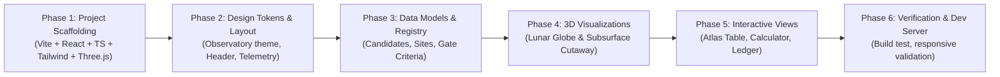

# LUNARVOID Web Application: Architectural & Design Plan

## 1. Project Overview & Aesthetic Direction

### The "Deep Lunar Observatory" Design System
Unlike generic SaaS templates, the LUNARVOID portal is engineered around an **aerospace observatory / NASA JPL mission-control aesthetic**:
- **Palette & Surfaces:**
  - Backgrounds: Deep Obsidian Void (`#070a0f`), Cosmic Charcoal (`#0b0f17`), and Mare Basalt (`#0e1420`).
  - Structural Reticles: Hairline sub-pixel grid lines (`rgba(255, 255, 255, 0.05)`) and technical crosshairs.
  - Scientific Accents: Neon Lunar Cyan (`#06b6d4`), Subsurface Radar Indigo (`#6366f1`), Bouguer Gravity Violet (`#a855f7`), Active Telemetry Green (`#10b981`), and Visual Inspection Amber (`#f59e0b`).
- **Typography:**
  - Primary UI & Prose: Clean geometric sans-serif (Inter / Geist).
  - Scientific Telemetry: Crisp tabular monospace (JetBrains Mono / Space Mono) for lunar coordinates ($\text{Lat/Lon}$), physical quantities ($\text{mGal}$, $\text{m/px}$, $\text{CPR}$), candidate IDs, and confidence intervals.
- **Micro-Interactions:** Subtle glow states, crisp card borders, telemetry pulse indicators, and smooth camera transitions.

---

## 2. Technical Stack Specification

The application will be initialized in `/home/frostflux/Ahnaf_Shafin/Projects/lunar-lavatube`:

| Layer | Technology | Purpose |
|---|---|---|
| **Runtime & Bundler** | Vite + React 18 + TypeScript | Instant HMR, strict type safety, zero bloat. |
| **Styling & Design System** | Tailwind CSS + PostCSS | Custom observatory tokens, glassmorphism, responsive layouts. |
| **3D Graphics Engine** | Three.js + `@react-three/fiber` + `@react-three/drei` | High-performance interactive 3D WebGL rendering. |
| **Iconography** | `lucide-react` | Crisp, modern technical icons. |
| **Data Visualization** | Custom Canvas / SVG + Three.js | Real-time Bayesian inference plots and graph networks. |

---

## 3. Core Modules & Component Architecture

```
src/
├── components/
│   ├── layout/
│   │   ├── Header.tsx             <- Global navigation, telemetry pills, gate state
│   │   └── Footer.tsx             <- Scientific citation, data sources, source-of-truth links
│   ├── 3d/
│   │   ├── LunarGlobe3D.tsx       <- Interactive 3D Moon sphere with real candidate pins & slerp camera
│   │   └── LavaTubeCutaway3D.tsx  <- 3D geological cutaway with animated radar sounding waves
│   ├── overview/
│   │   ├── ManifestoBanner.tsx    <- "We do not detect... we infer, with error bars"
│   │   ├── StatCounters.tsx       <- Calibration FP rate, sample space, benchmark anchor
│   │   └── PillarCards.tsx        <- Claim discipline, terrestrial analogs, frugal science
│   ├── atlas/
│   │   ├── CandidateTable.tsx     <- Searchable, sortable 257 candidate table
│   │   ├── FilterToolbar.tsx      <- Site pills (TRANQ, MARIUS, INGENII...), feature dropdown
│   │   └── CandidateDrawer.tsx    <- Slide-over panel with DTM, radar, and gravity breakdown
│   ├── fusion/
│   │   ├── PipelineStages.tsx     <- 4-layer methodology (Morphometry, Radar, Gravity, Analogs)
│   │   └── InferenceCalculator.tsx<- Interactive toy likelihood calculator with real-time FP envelope
│   ├── gates/
│   │   ├── GateTimeline.tsx       <- Verifiable milestones (G0', G1, G2 criteria & status)
│   │   └── BudgetLedger.tsx       <- Frugal science tracker ($0 spend, AX52 roadmap, $800 ceiling)
│   └── graph/
│       └── KnowledgeGraph.tsx     <- Visual representation of the Obsidian vault & MOC nodes
├── data/
│   ├── candidates.ts              <- Typed database of lunar candidates across 21 DTM sites
│   ├── sites.ts                   <- DTM site dossiers (coordinates, resolutions, geology)
│   └── gates.ts                   <- Verifiable gate specifications and pass/partial criteria
├── types/
│   └── index.ts                   <- Candidate, Site, EvidenceLayer, Gate, and Budget interfaces
├── App.tsx                        <- Main tab orchestration and global state
└── main.tsx                       <- Application mount point
```

---

## 4. Detailed Feature Specifications

### A. Interactive 3D Visualizations
1. **Interactive 3D Lunar Globe (`LunarGlobe3D.tsx`):**
   - Procedural or texture-mapped lunar sphere with authentic crater relief shading and customizable lighting terminator.
   - 3D interactive coordinate pins placed at exact lunar coordinates using spherical trigonometry:
     $$\begin{cases} x = R \cos(\text{lat}) \cos(\text{lon}) \\ y = R \sin(\text{lat}) \\ z = -R \cos(\text{lat}) \sin(\text{lon}) \end{cases}$$
   - Clicking a pin or selecting a row in the Candidate Atlas triggers a smooth camera orbit (`slerp`) to focus directly on that crater/pit site.
   - Orbit controls with auto-rotation, tilt constraints, and zoom limits.

2. **Interactive 3D Subsurface Lava Tube Cutaway (`LavaTubeCutaway3D.tsx`):**
   - 3D geological block cutaway illustrating:
     - Lunar surface regolith with a vertical rimless pit skylight.
     - Hollow basalt conduit cylinder extending underground.
     - Animated radar sounding rays emitting from an orbital beacon, penetrating down, and reflecting off the conduit ceiling and floor.
   - Controls to toggle radar animation, inspect cross-section dimensions, and rotate the block.

### B. Interactive Candidate Atlas & Registry
- Complete typed dataset reflecting the 257 candidates across 21 DTM sites:
  - `TRANQPIT1` (Mare Tranquillitatis Pit: 8.33°N, 33.22°E) — the sole confirmed anchor.
  - `MARIUS` (Marius Hills pit and sinuous rille sags: 14.09°N, 303.23°E).
  - `INGENIIPIT` (Mare Ingenii farside swirl-adjacent pit: 35.95°S, 166.06°E).
  - `PHILOLAUS` (High-latitude polar pit target: 72.10°N, 327.50°E).
  - `FECUNPIT` (Mare Fecunditatis candidate cluster: 0.92°S, 48.66°E).
- Real-time instant search by site name, ID, or morphological feature.
- Slide-over detail drawer displaying:
  - Target DTM metadata (product ID, resolution in $\text{m/px}$, stereo solar angle).
  - Radar layer status (Mini-RF CPR anomaly, Kaguya LRS reflector).
  - Bouguer mass deficit anomaly (GRAIL degree-1200 Bouguer reading).
  - Visual inspection backlog notes.

### C. Multi-Evidence Fusion & Interactive Calculator
- **Four Core Evidence Pillars:**
  1. *Surface Photogrammetry:* Stereo NAC pairs through USGS ISIS3 + NASA Ames Stereo Pipeline.
  2. *Radar CPR & Sounding:* Mini-RF circularly polarized ratio anomalies + Kaguya LRS echoes.
  3. *Bouguer Gravity:* GRAIL GL1200A mass-deficit bounds.
  4. *Terrestrial Analogs:* Structural geomechanics from Hawai'i and Valentine Cave LiDAR.
- **Interactive Calculator:**
  - Interactive sliders for *Depth/Span Ratio*, *Radar CPR Anomaly*, and *GRAIL Mass Deficit*.
  - Real-time recalculation of the calibrated likelihood score and estimated false-positive envelope per $10^4\text{ km}^2$.

### D. Gate Engine & Frugal Science Ledger
- **Gate Status:**
  - `Gate G0′` (Passed): Tier-0 environment, TRANQPIT1 stereo pipeline baseline.
  - `Gate G1` (Passed): 21 DTM sites processed, 257 candidates indexed.
  - `Gate G2` (Draft for Review): Multi-evidence calibration, Hetzner AX52 burst roadmap.
- **Transparent Budget Tracking:**
  - Interactive spend meters: $0.00 spent to date across 24 research sessions / $150 interim cap / $800 master-plan ceiling.

---

## 5. Phased Implementation Steps



1. **Phase 1 — Scaffolding:** Initialize Vite + React (TypeScript) in `/home/frostflux/Ahnaf_Shafin/Projects/lunar-lavatube`, install Tailwind, Three.js, `@react-three/fiber`, `@react-three/drei`, and `lucide-react`.
2. **Phase 2 — Design System & Layout:** Configure Tailwind theme, technical fonts, reticle grid utilities, global header, and telemetry indicators.
3. **Phase 3 — Data Models & Schemas:** Implement comprehensive candidate and site databases with authentic lunar coordinates and evidence scores.
4. **Phase 4 — 3D Components:** Build `LunarGlobe3D` with coordinate pins and `LavaTubeCutaway3D` with animated radar waves.
5. **Phase 5 — Interactive Feature Tabs:** Build Candidate Atlas with slide-over drawer, Bayesian inference calculator, and Gate/Budget ledger.
6. **Phase 6 — Testing & Build Validation:** Run TypeScript compilation, lint checks, and launch the dev server for verification.
