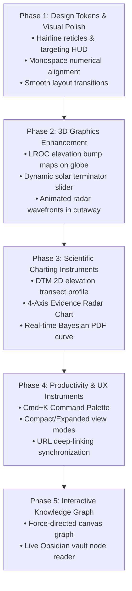

# LUNARVOID: UI/UX & Visual Experience Enhancement Plan

## 1. Executive Vision: From Functional Prototype to Aerospace Research Console

The current LUNARVOID web application establishes a solid baseline: clean layout, multi-tab routing, Three.js 3D globe and cutaway models, and functional data filtering. 

However, to elevate this into an **industry-defining planetary science portal** (matching the caliber of NASA Eyes on the Solar System, ESA Gaia archives, or CERN LHC experiment dashboards), we must transition from standard dashboard patterns to an **Aerospace Research Console & Observational Instrument**.

### Core Visual Principles:
1. **Precision & Restraint:** No whimsical SaaS gradients or bubbly cards. Every pixel, hairline border, and color accent must serve an observational or analytical purpose.
2. **Tactile Scientific Depth:** Multi-layered elevation surfaces (`#030712` -> `#0b0f19` -> `#111827`) paired with subtle glassmorphic backdrops, hairline reticles, and sub-pixel crosshairs inspired by LROC NAC targeting cameras.
3. **True Epistemic Aesthetics:** Visualizing *uncertainty, confidence intervals, and error bars* directly in the UI rather than displaying single deceptive scalar numbers.
4. **Cinematic 3D Scientific Visualizations:** Photorealistic crater relief, dynamic solar incidence lighting, animated radar sounding wavefronts, and volumetric geological block cross-sections.

---

## 2. Design System & Visual Token Overhaul

### 2.1 Color Palette & Radiance Tokens
The interface moves to a refined multi-tiered cosmic hierarchy:

| Token Name | Hex Code | Purpose |
|---|---|---|
| **Void Obsidian** | `#030712` | Deepest root canvas background. |
| **Lunar Basalt** | `#0a0f1d` | Card and viewport container backgrounds. |
| **Console Slate** | `#111827` | Interactive control panels, side drawers, and modal surfaces. |
| **Reticle Hairline** | `rgba(255, 255, 255, 0.07)` | Sub-pixel grid borders and framing crosshairs. |
| **Photometry Cyan** | `#06b6d4` | Surface photogrammetry, primary active states, and coordinates. |
| **Radar Indigo** | `#6366f1` | Subsurface radar CPR anomalies and sounding echoes. |
| **Bouguer Violet** | `#a855f7` | GRAIL mass-deficit gravity bounds. |
| **Telemetry Emerald** | `#10b981` | Verified benchmarks (MTP anchor), passed gates, and $0 budget discipline. |
| **Backlog Amber** | `#f59e0b` | Triage alerts and targets awaiting human NAC browse inspection. |

### 2.2 Typography & Numerical Formatting
- **Headings & Narrative Prose:** `Inter Display` / `Geist Sans` with crisp kerning and optical sizing.
- **Scientific Telemetry & Readouts:** `JetBrains Mono` or `Space Mono` configured with `font-variant-numeric: tabular-nums` to ensure numbers never jitter during real-time updates:
  - Standardized physical units formatted in monospace: $\text{m/px}$, $\text{mGal}$, $\text{CPR}$, $\text{km}^2$.
  - Coordinates formatted with unambiguous cardinal hemispheres (e.g., `08.33°N, 033.22°E`).
  - Error bars rendered explicitly: $6.06\ [2.77, 11.51]\text{ per }10^4\text{ km}^2$.

### 2.3 Optical Framing & Reticles
- **Targeting Crosshairs:** Subtle corner reticles on 3D viewports and candidate cards (`+` markers at the four corners of panels).
- **Sub-Pixel Grid:** Background grid with 24px coordinate increments and faint radial gradient mask so it fades gracefully towards the edges.
- **Glassmorphism:** `backdrop-blur-xl bg-obsidian-950/80 border border-white/10` for floating HUD controls and inspection drawers.

---

## 3. 3D WebGL Graphics & Visualization Upgrades

### 3.1 Interactive 3D Lunar Globe (`LunarGlobe3D`)
- **High-Fidelity Textures & Bump Mapping:**
  - Integrate high-resolution LROC WAC albedo basemap combined with LOLA/GLD100 elevation displacement/bump maps to render authentic craters (Copernicus, Tycho, Mare Tranquillitatis) with realistic depth.
- **Physically-Based Solar Terminator:**
  - Add an interactive **"Solar Incidence Angle" slider** in the HUD allowing the user to scrub the sun position across the lunar terminator, dynamically casting long grazing shadows across pit skylights and rille walls.
- **Advanced Coordinate Pin HUD:**
  - Replace simple sphere markers with **extruded altitude pins** and animated radar ping rings.
  - Billboard text labels floating above sites displaying name and candidate count that scale smoothly with camera distance.
- **Cinematic Camera Choreography:**
  - Clicking a candidate or site triggers a smooth spherical camera transition (`slerp`) that orbits and glides to a dramatic low-angle perspective facing the target pit crater.

### 3.2 Subsurface Lava Tube Cutaway (`LavaTubeCutaway3D`)
- **Volumetric Geological Strata:**
  - Clearly delineate three distinct geological units:
    1. *Regolith topsoil:* 5–15m fine-grained impact debris.
    2. *Basalt flow units:* Layered cooling basalt lava sheets.
    3. *Hollow Conduit Cavity:* Parabolic or arched basalt tube ceiling based on geomechanical stability models.
- **Interactive Cross-Section Clipping Plane:**
  - Add a dynamic slider to "slice" through the geological block along the longitudinal axis, exposing the internal cave chamber and talus cone beneath the skylight.
- **Particle Radar Wavefronts:**
  - Replace static dashed lines with animated 3D particle wavefronts that emit from an orbital spacecraft, refract through the regolith, reflect off the ceiling, and echo back with intensity fading indicating radar attenuation.

---

## 4. New Scientific Data Visualizers & Instruments

### 4.1 Interactive DTM Elevation Transect Profile
- Beneath the 3D Cutaway or inside the Candidate Drawer, add an interactive **2D Elevation Transect Chart (Cross-Section A-A')**:
  - Shows the elevation cross-section derived from LROC NAC DTM data.
  - Plots surface terrain, rim lip, steep vertical drop (e.g., -105m at MTP), rubble talus floor, and opposite wall.
  - Hovering over the transect displays exact distance along transect ($X$) and elevation relative to lunar datum ($Z$).

### 4.2 Multi-Evidence Radar / Spider Matrix
- An interactive SVG/Canvas radar chart comparing candidates across the 4 physical evidence axes:
  1. *Morphometric Skylight Sinuosity*
  2. *Mini-RF CPR Contrast Anomaly*
  3. *GRAIL Bouguer Deficit Consistency*
  4. *Geomechanical Roof Stability Index*
- Allows visual comparison between high-confidence candidates (TRANQPIT1, Marius) vs degraded crater false positives.

### 4.3 Real-Time Bayesian Likelihood PDF Curve
- In the Evidence Fusion calculator:
  - Add a dynamic probability density function (PDF) curve showing the likelihood distribution $P(\text{Void} \mid E)$ alongside the false-positive risk envelope.
  - As the user moves the morphometry, radar, or gravity sliders, the Gaussian bell curve shifts and narrows in real-time.

---

## 5. UX Ergonomics, Micro-Interactions & Navigation

### 5.1 Quick Command Palette (`Cmd+K` / `Ctrl+K`)
- Implement an omnipresent command palette allowing researchers to:
  - Instantly search all 257 candidates by ID, coordinate, or morphology.
  - Jump directly to any of the 21 DTM target sites.
  - Jump to Gate reviews (G0′, G1, G2) or budget ledger.
  - Toggle 3D globe auto-rotation or change visualization layers.

### 5.2 Table Ergonomics & View Modes
- **Density Toggle:** Switch between *Compact Console* (monospace table with maximum information density) and *Visual Dossier* (cards with DTM preview footprints and score badges).
- **Multi-Column Sorting:** Sort candidates by Score, Lat, Lon, Depth, CPR, or Bouguer anomaly with clear directional indicators.
- **Quick Copying:** One-click copy buttons for LaTeX citations, candidate GeoJSON coordinates, and LROC product IDs.

### 5.3 Deep Linking & URL State Synchronization
- Reflect all navigation and selection state in browser query parameters:
  - `?tab=atlas&site=TRANQPIT1&candidate=CAND-TRANQ-001`
  - Allows researchers to share direct links to exact candidate dossiers or specific gate reports.

### 5.4 Visual Feedback & Micro-Animations
- **Telemetry Pulse Indicators:** Subtle animated glows on live data points.
- **Tab Transitions:** Smooth slide-fade transitions between main tabs using CSS hardware acceleration (`transform: translate3d`).
- **Sound Feedback (Optional & Muted by Default):** Subtle low-frequency tactile clicks when switching console modes or triggering the calculation engine.

---

## 6. Interactive Knowledge Graph Canvas

Upgrade the Knowledge Tab from static cards into an interactive **2D Force-Directed Knowledge Network**:
- Interactive nodes representing:
  - MOCs (Hub nodes)
  - 21 Site Dossiers (Cyan nodes)
  - Decision Records D1/D2 and Gates G0'/G1/G2 (Emerald nodes)
  - Key Methodological Concepts (Purple nodes)
- Users can zoom, pan, and click any node to pull up the complete markdown note content directly from the Obsidian vault.

---

## 7. Phased Implementation Roadmap

---

## 8. Summary of Deliverables

By executing this plan, LUNARVOID will transform from a standard project showcase into an **authoritative, high-performance planetary science instrument** that seamlessly blends rigorous epistemic transparency with modern WebGL engineering.
